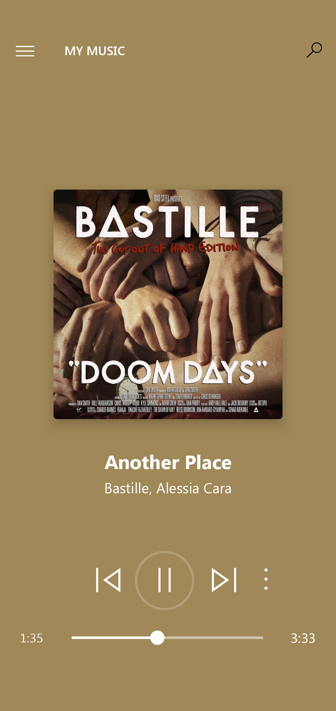
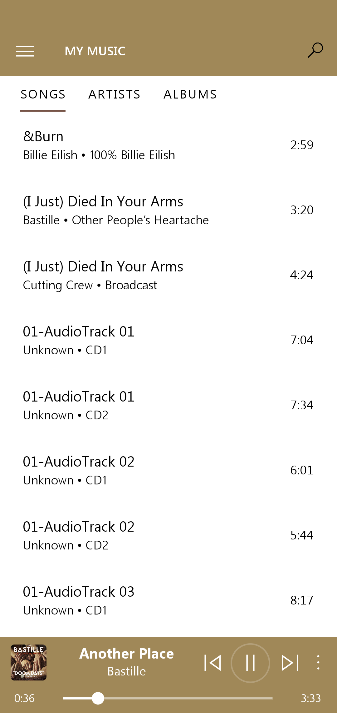
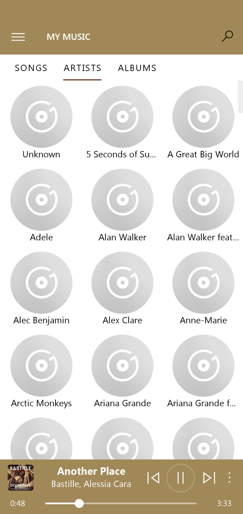
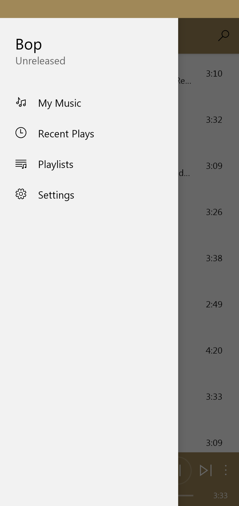
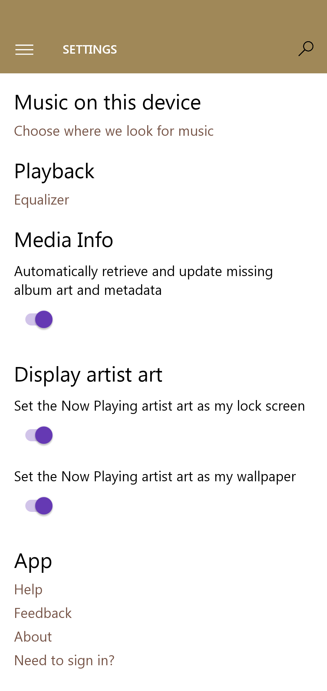

# BOP Music
#### Local music player using MVVM design pattern

The application may serve as an example of
 - ViewModel
 - Room Database
 - Dagger-Hilt
 - Background Service
 - Motion Layout
 - MediaPlayer
 - MediaStore
 - RecyclerView
 - Media Controls
 - ViewPager2
 - Broadcasting intents

Here's how the app's major components interact and communicate with each other.

### [Download the latest pre-release build](app/release/GrooveMusicClone-app-release-09.apk)
---

